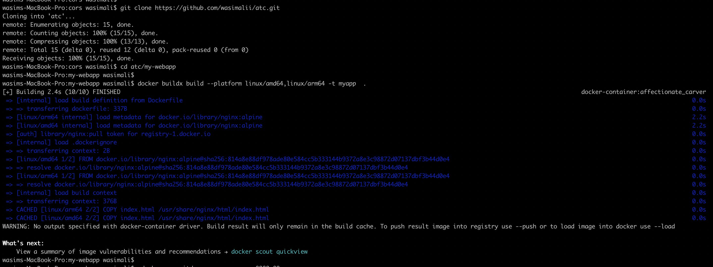
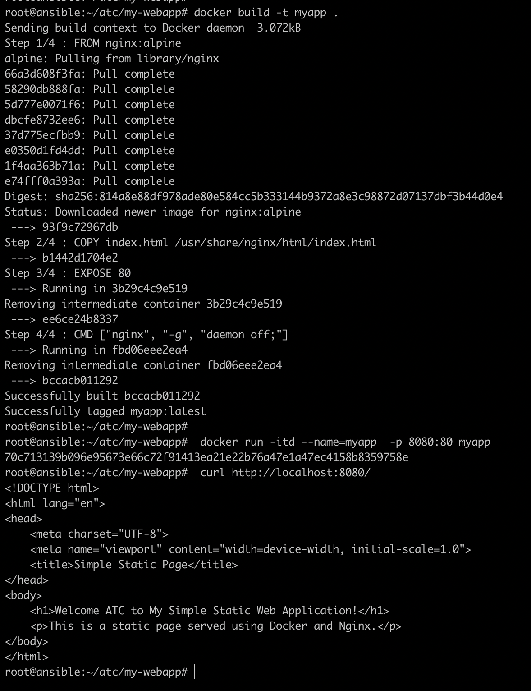
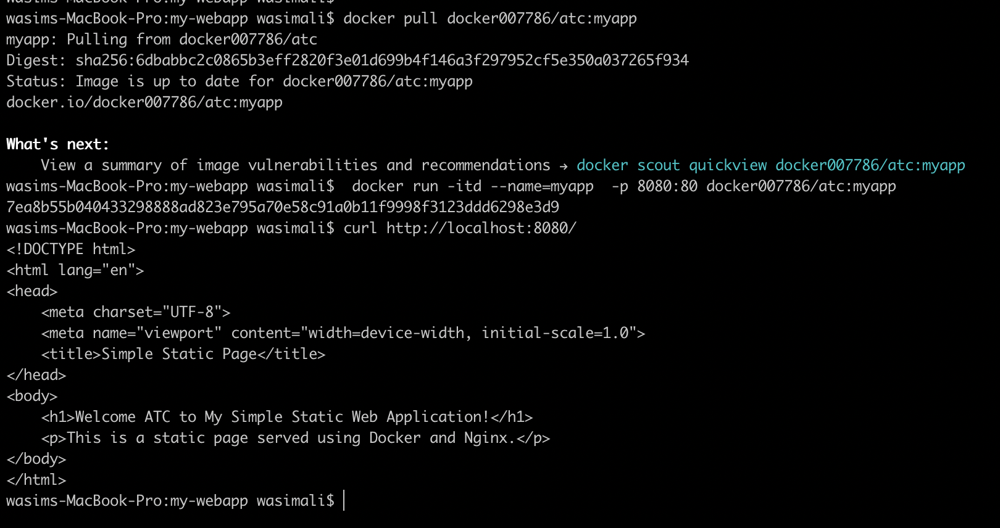
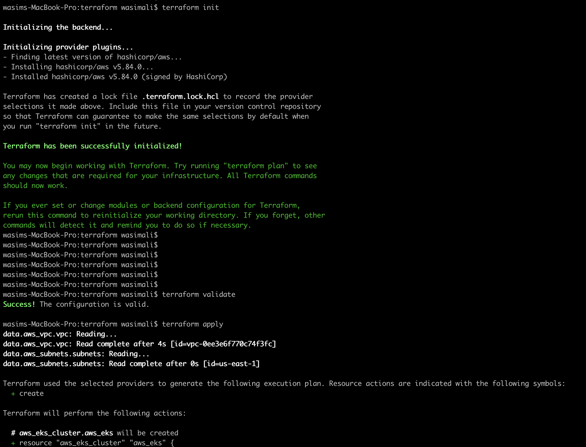
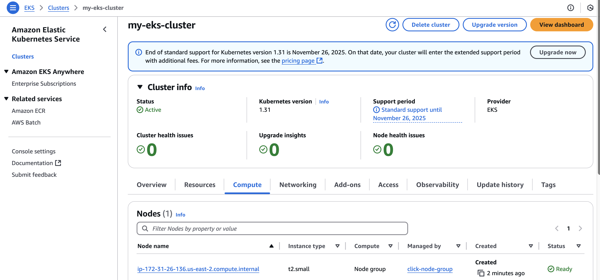

# atc

## Prerequisites  

Before proceeding with this task, ensure you have the following prerequisites:  

- **Docker** and **kubectl** installed on your system.  
- An **AWS account** with **Access Key ID** and **Secret Access Key** configured.  

### Generate AWS Access Key and Secret Key  

Follow these steps to create AWS Access and Secret Access Keys:  

1. Log in to the **AWS Management Console**.  
2. Click on your profile name (top-right corner).  
3. Select **"My Security Credentials"**.  
4. Navigate to the **Access Keys** section.  
5. Click **"Create New Access Key"** to generate a new set of keys.  

### Configure AWS Credentials for Terraform  

Use these keys to authenticate Terraform with AWS by setting them in your environment variables:  

export AWS_ACCESS_KEY_ID="your-access-key"
export AWS_SECRET_ACCESS_KEY="your-secret-key"

#================= Step 1 Create Docker image For sample web application.======================

###### Create Docker Image #####

# 1. Clone the repo to you local system
git clone https://github.com/wasimalii/atc.git 
cd atc/my-webapp

# 2. Run Docker build to build the sample web application
docker buildx build --platform linux/amd64,linux/arm64 -t <imag-tag> .    # Note: I am using macOS, so I include the platform flag to ensure that my image runs on both platforms.
Or docker build -t <image-tag> . # To simply build image irespective of platform

# 3. To run sample web application locally
 docker run -itd --name=myapp -p 8080:80 myapp
 curl http://localhost:8080/  # you will see the nginx page 

############# NOTE: I have alredy created docker image from Dockerfile present in this repo you can simply pull image from my public repo and run it. #########
docker pull docker007786/atc:myapp 
docker run -itd --name=myapp -p 8080:80 docker007786/atc:myapp 
curl http://localhost:8080/

 

**==================== Step 2 Create an EKS Cluster with a Node Pool in AWS Using Terraform  .===================**

**Note:** Before running the Terraform scripts, you need to export your AWS Access Key and Secret Access Key.  

### 1. Navigate to the Terraform Directory, Initialize, and Validate the Terraform Files  
cd /atc/terraform
terraform init
terraform validate

# 2. Terraform commands to plan and apply the configuration:
terraform plan
terraform apply

# 3.Expected Output: 
An EKS cluster along with node-pool attached is ctreated in us-east-2 region aws

**================= Step 3 Deploy Sample web application on eks cluster.=================** 

# Fetch aws credentials
atc/kube-deployment-file
aws eks --region us-east-2 update-kubeconfig --name my-eks-cluster

#  check aws cluster in kubeconfig
kubectl config get-clusters | grep aws

# create deployment and service 
kubectl apply -f myapp-deployment.yml myapp-service.yml

# access the servcie using port forward 
kubectl port-forward service/myapp-service 8080:80

