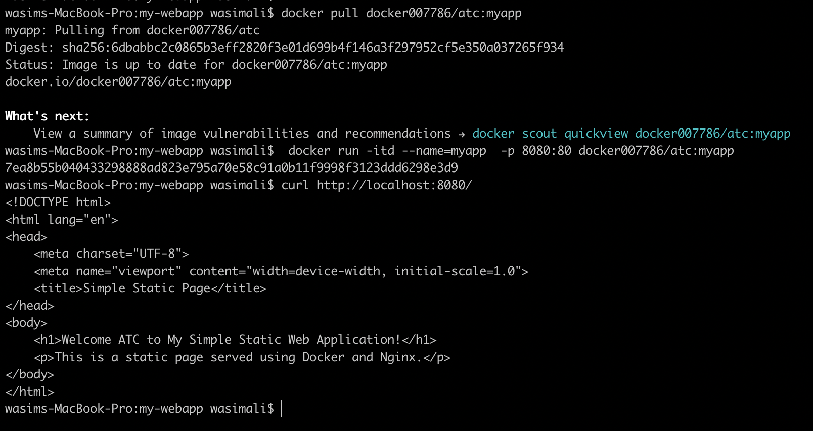

# atc

## Prerequisites  

Before proceeding with this task, ensure you have the following prerequisites:  

- **Docker** and **kubectl** installed on your system.  
- An **AWS account** with **Access Key ID** and **Secret Access Key** configured.  

### Generate AWS Access Key and Secret Key  

Follow these steps to create AWS Access and Secret Access Keys:  

1. Log in to the **AWS Management Console**.  
2. Click on your profile name (top-right corner).  
3. Select **"My Security Credentials"**.  
4. Navigate to the **Access Keys** section.  
5. Click **"Create New Access Key"** to generate a new set of keys.  

### Configure AWS Credentials for Terraform  

Use these keys to authenticate Terraform with AWS by setting them in your environment variables:  

```sh
export AWS_ACCESS_KEY_ID="your-access-key"
export AWS_SECRET_ACCESS_KEY="your-secret-key"


**================= Step 1 Create Docker image For sample web application.=================**<br>

###### Create Docker Image 

# 1. Clone the repo to you local
git clone https://github.com/wasimalii/atc.git<br>
cd atc/my-webapp

# 2. Run Docker build to build the sample web application
docker buildx build --platform linux/amd64,linux/arm64 -t <imag-tag> .    # Note: I am using macOS, so I include the platform flag to ensure that my image runs on both platforms.
Or docker build -t <image-tag> . # To simply build image irespective of platform


# 3. To run sample web application locally
 docker run -itd --name=myapp  -p 8080:80 myapp
 curl http://localhost:8080/  # you will see the nginx page 


# 1. Pull the Docker Image
docker pull docker007786/particle41:myapp

# 2. Run the Docker Container
docker run -itd --name=voo -p 5000:5000 docker007786/particle41:myapp

# 3. Access the App
curl http://localhost:5000<br>
Note: check ports 


## Note: i have alredy created docker image from dockerfile present in this repo you can simply pull image from my public repo and run it<br>

docker pull docker007786/atc:myapp<br>
docker run -itd --name=myapp  -p 8080:80 docker007786/atc:myapp<br>
curl http://localhost:8080/

 


**================= Step 2 Create EKS cluster with node-pool attached in AWS using terraform.=================**<br>

### Prerequisites<br>
Before running the Terraform scripts, you need to set up your AWS Access and Secret Access Keys. Follow the steps below:<br>

Go to the AWS Management Console.<br>
Click on your profile name (located at the top-right corner). ---->  Select "My Security Credentials." ----> Navigate to the Access Keys section. ---> Click on "Create New Access Key" to generate a set of keys.<br>

Use these keys to authenticate Terraform with AWS by setting them in your environment variables or a credentials file<br>

# 1. Navigate to the Terraform directory:
cd /atc/terraform<br>
terraform init
terraform validate<br>
terraform plan<br>
terraform apply


# 2. Terraform commands to plan and apply the configuration:
terraform plan<br>
terraform apply

# 3.Expected Output: 

Accessing the Application Load Balancer (ALB) DNS will show an Nginx default page.

The following resources will be created:<br>
A VPC with 2 public subnets and 2 private subnets.<br>
An ECS cluster deployed in the private subnets of the VPC.<br>
An ECS Task running nginx container.<br>
A Load Balancer (ALB) in the public subnets to route traffic to the private subnets where tasks are running.


**================= Step 3 Deploy ample web application on eks cluster.=================**<br>

# Fetch aws 
atc/kube-deployment-file<br>
aws eks --region us-east-2 update-kubeconfig --name my-eks-cluster


#  
kubectl config get-clusters | grep aws

#
kubectl apply -f myapp-deployment.yml myapp-service.yml

# 
 kubectl port-forward service/myapp-service 8080:80

# 


